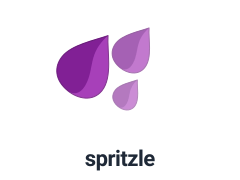

<p align="center">
  
</p>

<p align="center">
  <strong>A lightweight, high-performance BitTorrent client &amp; REST daemon built on libtorrent.</strong>
</p>

---

Spritzle is a lightweight bittorrent client built around libtorrent. It aims
to provide a simple REST interface to libtorrent. Any additional
functionality should be provided by a hook extending spritzle.

Installation
------------

### From Source (Development)

Clone the repository and install dependencies with [uv](https://github.com/astral-sh/uv):

```bash
git clone https://github.com/spritzle/spritzle.git
cd spritzle
uv sync
```

### Global CLI & Daemon Installation

To install the pure-Python `spritzle` CLI (no native dependencies required):

```bash
uv tool install spritzle
# or with pipx:
# pipx install spritzle
```

To install the `spritzled` daemon (includes native `libtorrent` bindings):

```bash
uv tool install "spritzle[daemon]"
# or with pipx:
# pipx install "spritzle[daemon]"
```

On Linux distributions where `libtorrent` is installed via your system package manager (e.g. `python-libtorrent` on Arch Linux), install with system site packages enabled:

```bash
pipx install --system-site-packages spritzle
```

Development
-----------

To run the daemon locally during development:

```bash
uv run spritzled
```

To run the CLI:

```bash
uv run spritzle
```

Testing
-------

To run the tests:

```bash
uv run pytest
```

Documentation
-------------

* [spritzled Daemon Guide](docs/spritzled.md): Daemon CLI options, configuration keys, systemd service setup, and token generation.
* [spritzle CLI Guide](docs/spritzle.md): Command-line client usage, subcommands reference, authentication, and bash completion.
* [Remote Daemons & API Keys](docs/remotes.md): Remote profiles, zero-config local discovery, and daemon identity verification.
* [REST API Interface](docs/interface.md): Full HTTP REST API reference and examples.
* [Hooks System](docs/hooks.md): Custom scripting with libtorrent status alerts.
* [Docker & VPN Deployment](docs/docker.md): Lightweight Docker container deployment and Gluetun VPN leak protection.
* [Architecture Design](docs/design.md): System architecture and request lifecycle.

Authors
-------

* Andrew Resch <andrewresch@gmail.com>

